 

<h1 align="center">
  <b>DUVVURU PRAVANYA SREE</b>
</h1>

<h3 align="center">
  COMPUTER SCIENCE ENGINEERING STUDENT
</h3>

  <b>Software Development · Web Development · Analytics · AI/ML</b>

 

  

<a href="#01--about"><b>ABOUT</b></a>
&nbsp;·&nbsp;
<a href="#03--featured-projects"><b>PROJECTS</b></a>
&nbsp;·&nbsp;
<a href="#05--tech-stack"><b>SKILLS</b></a>
&nbsp;·&nbsp;
<a href="#07--currently-exploring"><b>LEARNING</b></a>
&nbsp;·&nbsp;
<a href="#08--connect"><b>CONTACT</b></a>

 

 

## 01 — ABOUT

I'm a Computer Science Engineering student interested in building practical software and exploring how technology can turn ideas into useful digital experiences.

My work currently spans software development, web applications, analytics and interactive technology, with AI/ML as an area I'm actively exploring. I learn primarily by building, experimenting and improving projects.

 

 

## 02 — WHAT I BUILD

<table width="100%">
<tr>
<td width="25%" valign="top" align="center">

**🖥 SOFTWARE & APPLICATION DEVELOPMENT**

Building practical applications and exploring application design.

</td>
<td width="25%" valign="top" align="center">

**🌐 WEB DEVELOPMENT**

Creating interactive and visually engaging web experiences.

</td>
<td width="25%" valign="top" align="center">

**📊 DATA & ANALYTICS**

Working with dashboards, business data and analytical thinking.

</td>
<td width="25%" valign="top" align="center">

**🤖 AI/ML & INTERACTIVE TECH**

Exploring intelligent and interactive technology through projects.

</td>
</tr>
</table>

 

 

## 03 — FEATURED PROJECTS

 

<table width="100%">
<tr>
<td width="100%">

### 01 — MAP
**Marketing Analytics Platform**

A dashboard-based marketing analytics platform designed to turn business data into structured insights, presenting analytical information through a clean, interactive interface.

`Marketing Analytics` · `Dashboard` · `Data`

</td>
</tr>
</table>

 

<table width="100%">
<tr>
<td width="100%">

### 02 — AERIX
**Air Draw / Interactive Drawing**

An interactive, touch-free drawing experience built around hand movement and real-time interaction, allowing users to draw on a digital canvas without a conventional mouse-driven interface.

`Interactive Technology` · `Web` · `Real-Time Interaction`

</td>
</tr>
</table>

 

<table width="100%">
<tr>
<td width="100%">

### 03 — BOTANICA FLORA
**Floral E-Commerce Web Application**

A web-based floral e-commerce application focused on product discovery, visual presentation and an interactive shopping experience. The project explores application development through a complete web interface and demonstrates practical work with frontend development, UI/UX and e-commerce concepts.

`Web Development` · `Application Development` · `E-Commerce` · `UI/UX`

</td>
</tr>
</table>

 

 

## 04 — OTHER BUILDS

<table width="100%">
<tr>
<td width="50%" valign="top">

**Mathematical Operations**
 
A web-based project exploring mathematical operations through an interactive application interface.

</td>
<td width="50%" valign="top">

**Your Nutritional Life Journey**
 
An interactive web experience exploring nutrition and lifestyle through visual interaction.

</td>
</tr>
<tr>
<td width="50%" valign="top">

**Foreign Trading System — OOSE**
 
An object-oriented software engineering project based around a foreign trading system.

</td>
<td width="50%" valign="top">

**Christmas Vibes**
 
A creative web project exploring Christmas-themed visual design, animation and interactive front-end presentation.

</td>
</tr>
</table>

 

 

## 05 — TECH STACK

Technologies I currently use and explore through projects.

  

**Languages**

**Web / Development**

**Data / AI**

**Tools**

 

 

## 06 — DEVELOPMENT JOURNEY

**01 — LEARN**
&nbsp;→&nbsp;
**02 — EXPLORE**
&nbsp;→&nbsp;
**03 — BUILD**
&nbsp;→&nbsp;
**04 — TEST**
&nbsp;→&nbsp;
**05 — IMPROVE**
&nbsp;→&nbsp;
**06 — SOLVE REAL PROBLEMS**

 

 

## 07 — CURRENTLY EXPLORING

| Area | Status |
|---|---|
| TypeScript | Exploring |
| Full-Stack Development | Learning |
| Modern Web Development | Building with |
| Software Engineering | Learning |
| Analytics | Exploring |
| AI/ML | Exploring |

 

 

## 08 — CONNECT

)

 

 

**DUVVURU PRAVANYA SREE**

Computer Science Engineering Student

*Learn · Build · Create*

<a href="#top">back to top ↑</a>

